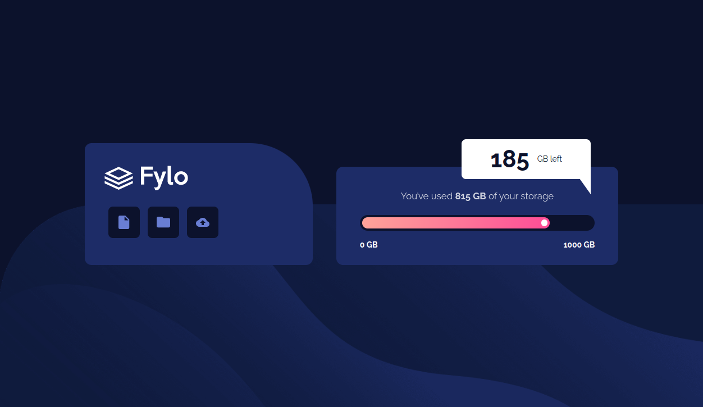

# Frontend Mentor - Fylo data storage component solution

This is a solution to the [Fylo data storage component challenge on Frontend Mentor](https://www.frontendmentor.io/challenges/fylo-data-storage-component-1dZPRbV5n). Frontend Mentor challenges help you improve your coding skills by building realistic projects. 

## Table of contents

- [Overview](#overview)
  - [The challenge](#the-challenge)
  - [Screenshot](#screenshot)
  - [Links](#links)
- [My process](#my-process)
  - [Built with](#built-with)
  - [What I learned](#what-i-learned)
  - [Continued development](#continued-development)
  - [Useful resources](#useful-resources)
- [Author](#author)
- [Acknowledgments](#acknowledgments)

**Note: Delete this note and update the table of contents based on what sections you keep.**

## Overview

### The challenge

Users should be able to:

- View the optimal layout for the site depending on their device's screen size

### Screenshot

### Links

- Solution URL: [Github repo](https://github.com/PriyanshuSahani/frontend-data-storage-layout)
- Live Site URL: [Add live site URL here](https://your-live-site-url.com)

## My process

- Analysed the required layout to determine how I need to structure my HTML.
- Created the HTML, optimally using divs and section to simplify the CSS file.
- Finally, in style.css:
	- First setup the root variables
	- Applied the CSS reset
	- Built the layout(Positioning and sizing the divs)
	- Added colors and fonts.
	- Added media queries to make responsive

### Built with

- Semantic HTML5 markup
- CSS custom properties
- Flexbox
- Mobile-first workflow

### What I learned

- Learnt how to use CSS custom properties to synchronize placement and sizing of various elements. 
- It was required as the design had absolute positioning to achieve the chat bubble. 
- The chat bubble itself is a composition of a rectangular box and a triangular svg hence it was challenging to get them to stay consistent.

## Author

- Frontend Mentor - [PriyanshuSahani](https://www.frontendmentor.io/profile/PriyanshuSahani)
